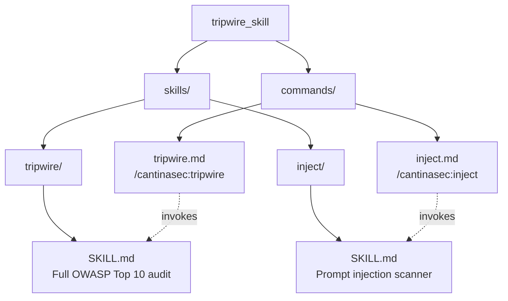

# cantinasec/tripwire + inject

Proposed addition to [cantina.security/resources/security-plugins](https://www.cantina.security/resources/security-plugins).

Two Claude Code slash commands for auditing AI agent pipelines against the OWASP Top 10 for Agentic Applications 2026.

## Repo structure



## Commands

| Command | What it does |
|---|---|
| `/cantinasec:tripwire` | Full audit across all 10 OWASP Agentic risk categories. Auto-detects `crew.py`, `agents.yaml`, `tasks.yaml`, and `.json` workflows. Returns drop-in hardened prompts per finding. |
| `/cantinasec:inject` | Focused prompt injection scan (ASI01). Finds raw interpolation surfaces, unfiltered tool outputs, and cross-agent propagation chains. |

## Install

```bash
mkdir -p ~/.claude/commands/cantinasec
curl -sL https://raw.githubusercontent.com/aidan269/owasp-project/main/commands/tripwire.md \
  -o ~/.claude/commands/cantinasec/tripwire.md
curl -sL https://raw.githubusercontent.com/aidan269/owasp-project/main/commands/inject.md \
  -o ~/.claude/commands/cantinasec/inject.md
```

Then in Claude Code:

```
/cantinasec:tripwire
/cantinasec:inject
```
